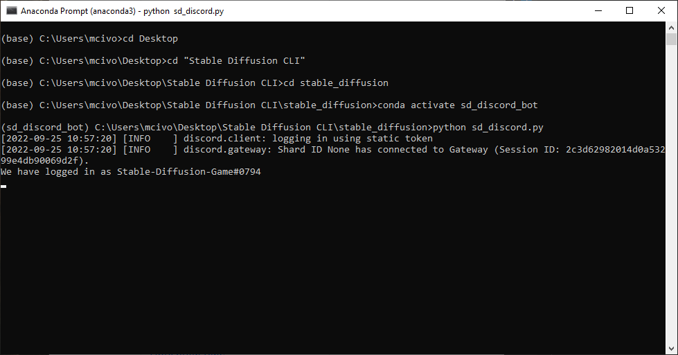
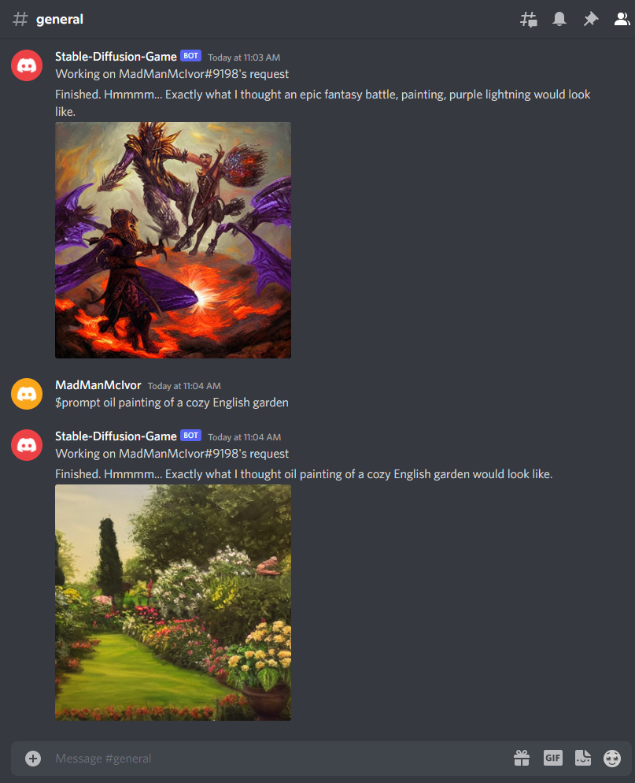

# Stable Diffusion Discord Bot

This is a fork of [InvokeAI's fork of Stable Diffusion](https://github.com/invoke-ai/InvokeAI). It adds a simple Discord bot so that you can send prompts via Discord and receive images back.

This is self hosted, so it's not using any third party APIs that you'll have to pay credits for, but that means it'll only run after you've set it up and are running the program.

## More Features Coming Soon (Hopefully)
The plan is to turn this into a playable game on Discord, but for now it's just a bot that receives prompts and returns the images. As I have time, I'll add more features.

## Installation
 1. Set up a bot on Discord and add it to your server. Here are [instructions.](https://discordpy.readthedocs.io/en/stable/discord.html)
 2. Follow the installation steps on [InvokeAI's fork of Stable Diffusion](https://github.com/invoke-ai/InvokeAI).  This [article](https://stablediffusionguides.carrd.co/#four) also does a good job running through the process.
 3. Instead of activating the environment as `conda activate ldm`, use `conda activate sd_discord_bot` 
 4. Create a file named "bot_token.py" in the main directory. In it, create a variable and put your bot's token in like this: 
    `bot_token = 'XXXXXXXXXXXXXXXXXXXXXXXXXX'`
5. Enter `python sd_discord.py` into your Anaconda/Miniconda terminal. It should look like this: 
 
6. Enter a prompt on your Discord Server using `$prompt` followed by the prompt. Example: 

## This was built on top of the work from:
- [InvokeAI's fork of Stable Diffusion](https://github.com/invoke-ai/InvokeAI)
- [Work from Lincoln Stein](https://github.com/lstein)
- [Stability AI's Stable Diffusion](https://github.com/CompVis/stable-diffusion)

## Final Note
This is a work in progress (and also my first Discord Bot), but I was too excited not to share it before it was finished. If you have any comments, concerns, suggestions, or bugs that you notice, feel free to reach out to me on Discord (MadManMcIvor#9198)
